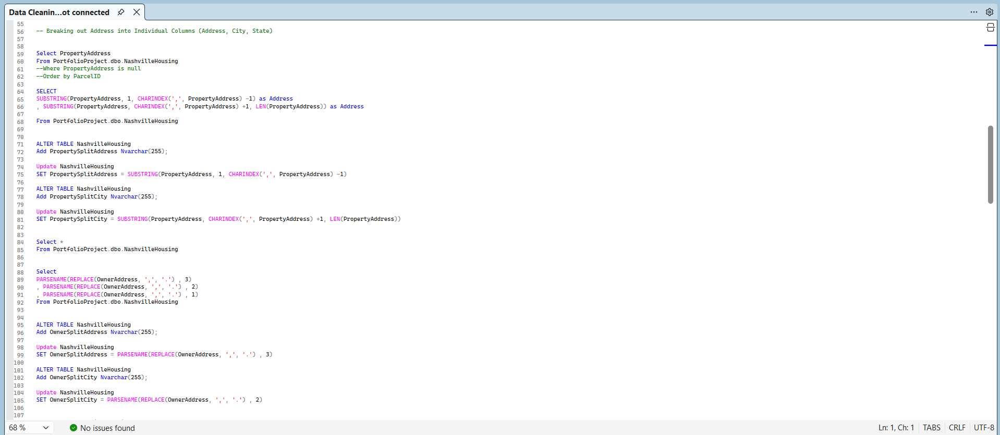
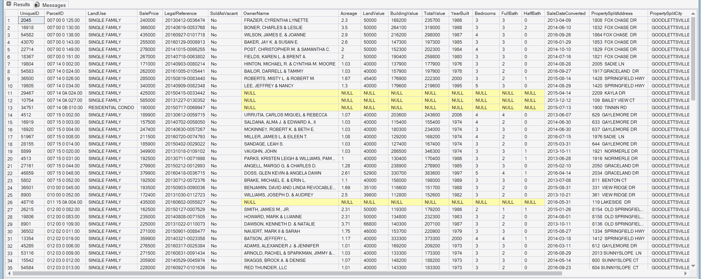
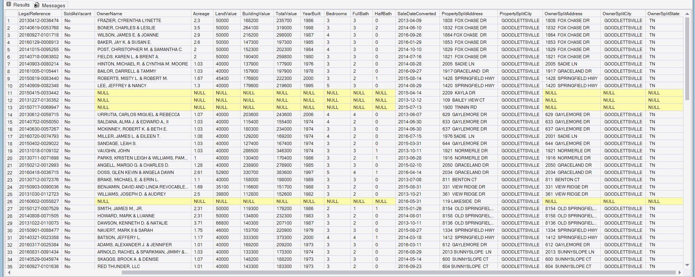

# Nashville Housing Data Cleaning Project

## Project Overview

This project demonstrates how SQL Server can be used to clean and prepare a real estate housing dataset for analysis. The dataset contained several common data quality issues, including inconsistent date formats, missing property addresses, combined address fields, inconsistent categorical values, duplicate records, and redundant columns.

The purpose of this project was to transform the raw Nashville housing dataset into a cleaner, more structured format that would be easier to analyse, report on, and use for future business intelligence work.

## Business Problem

Raw property datasets are often difficult to analyse because they contain inconsistent formats, missing information, duplicate records, and fields that combine multiple pieces of information into a single column.

For property analysts, real estate businesses, local authorities, or business intelligence teams, poor data quality can lead to inaccurate reporting and unreliable insights.

This project focuses on preparing the dataset so that future analysis can be carried out more accurately and efficiently.

## Tools Used

- SQL Server
- SQL Server Management Studio
- T-SQL
- GitHub

## Dataset

The project uses a Nashville housing dataset containing property sale records. The dataset includes fields such as sale date, property address, owner address, sale price, land use, legal reference, parcel ID, and whether the property was sold as vacant.

## Data Cleaning Process

The SQL script performs the following cleaning steps:

### 1. Standardised Date Format

The `SaleDate` field was converted into a cleaner date format to improve consistency and readability.

### 2. Populated Missing Property Addresses

Missing property addresses were populated by matching records with the same `ParcelID`. This was completed using a self join.

### 3. Split Property Address into Separate Columns

The original property address field contained both address and city information. This was split into:

- `PropertySplitAddress`
- `PropertySplitCity`

### 4. Split Owner Address into Separate Columns

The original owner address field contained address, city, and state information. This was split into:

- `OwnerSplitAddress`
- `OwnerSplitCity`
- `OwnerSplitState`

### 5. Standardised Sold As Vacant Values

The `SoldAsVacant` field contained inconsistent values such as `Y`, `N`, `Yes`, and `No`. These were standardised into clearer `Yes` and `No` values.

### 6. Removed Duplicate Records

Duplicate records were identified using a CTE and `ROW_NUMBER()` function. Records were checked using key fields such as:

- `ParcelID`
- `PropertyAddress`
- `SalePrice`
- `SaleDate`
- `LegalReference`

Duplicate rows were then removed from the dataset.

### 7. Removed Redundant Columns

After creating cleaner replacement columns, unused columns were removed from the dataset to improve structure and usability.

## SQL Skills Demonstrated

- Data cleaning
- Data standardisation
- Handling null values
- Self joins
- String manipulation
- `SUBSTRING()`
- `CHARINDEX()`
- `PARSENAME()`
- `REPLACE()`
- `CASE` statements
- Common Table Expressions
- `ROW_NUMBER()`
- Duplicate removal
- Schema modification with `ALTER TABLE`
- Updating records with `UPDATE`

## Project Files

| File/Folder | Description |
|---|---|
| `sql/nashville_housing_data_cleaning.sql` | Main SQL data cleaning script |
| `data/` | Raw dataset used for the project |
| `images/` | Screenshots of the SQL script and cleaned dataset |
| `docs/data_cleaning_summary.md` | Written summary of the cleaning process |

## Preview

### SQL Script Preview

### Raw Data Preview

### Cleaned Data Preview

## Key Outcome

The final dataset is cleaner, more consistent, and better structured for analysis. The project shows how SQL can be used not just for querying data, but also for preparing raw data into a reliable analytical format.

## What This Project Demonstrates

This project demonstrates my ability to work with raw data, identify data quality problems, apply SQL-based cleaning techniques, and produce a structured dataset suitable for reporting and further analysis.

It forms part of my wider data analytics portfolio, alongside projects in road safety analytics, e-commerce funnel analysis, Power BI dashboarding, Excel analysis, and business intelligence reporting.